# AI英语口语陪练 (AI Spoken English Trainer)

> 一款基于 AI 的英语口语练习工具，支持多种真实场景下的对话训练、实时发音评测、语法纠错和课后量化学习报告。

[](https://www.python.org/)
[](https://fastapi.tiangolo.com/)
[](https://nextjs.org/)
[](https://www.typescriptlang.org/)
[](LICENSE)

---

## 项目简介

AI英语口语陪练是一个面向英语学习者的智能口语练习平台。用户可以在**职场面试、餐厅点餐、商务会议**三个真实场景中与AI进行实时英语对话，获得即时的发音评分、语法纠正和课后量化报告，实现口语能力的可量化提升。

### 项目背景

在全球化的今天，英语口语能力已成为职场竞争、学术深造和跨文化交流的核心技能。然而，中国英语学习者普遍面临 **"哑巴英语"困境**——阅读和写作能力尚可，但一到开口说就紧张、卡顿、词不达意。

传统口语提升路径存在明显的局限：

- **外教一对一**：费用高昂（150-300元/小时），需预约，时间不灵活
- **语言交换伙伴**：匹配困难，对方未必有教学经验，反馈质量不稳定
- **英语角/培训班**：缺乏个性化指导，无法针对个人薄弱点精准练习
- **现有口语 App**：多为"跟读+打分"模式，缺少真实对话交互，无法模拟实际交流场景

大语言模型 (LLM) 和语音技术的成熟，让 **"随时随地与 AI 进行沉浸式英语对话"** 成为可能。本项目正是基于这一契机，构建一个覆盖"对话练习→发音纠错→语法诊断→量化报告"完整闭环的 AI 口语陪练系统。

### 用户痛点与解决方案

| 痛点 | 具体表现 | 本项目的解决方案 |
|------|----------|------------------|
| 😰 **不敢开口** | 害怕犯错、缺乏自信、没有安全的练习环境 | AI 陪练零压力——无评判、无尴尬、无限重来 |
| ⏰ **时间成本高** | 外教需预约，无法随时练习 | 7×24 小时在线，打开浏览器即可开始对话 |
| 💸 **经济门槛高** | 一对一外教 150-300 元/小时 | Edge TTS 免费 + DeepSeek 极低成本，基本零门槛 |
| 🎯 **反馈缺失** | 说完了不知道对错，问题反复出现 | 逐轮发音评分 + 语法纠错，每句话都有即时反馈 |
| 📊 **进步无感** | 练了很久，不知道是否在提升 | 六维量化报告 + 评分历史曲线，进步一目了然 |
| 🔄 **场景脱节** | 学的英语和实际用到的场景不匹配 | 职场面试 / 餐厅点餐 / 商务会议三大真实场景模拟 |
| 🗣️ **缺乏互动** | 跟读类 App 机械乏味，无法维持练习动力 | LLM 驱动的自由对话，AI 有角色、有性格、有温度 |

### 核心功能

| 功能 | 说明 |
|------|------|
| **场景选择** | 3个真实场景（职场面试 / 餐厅点餐 / 商务会议），每个场景配有专属AI人设 |
| **难度档位** | 每个场景支持初级/中级/高级3个难度，AI对话内容随难度自适应调整 |
| **实时语音对话** | 浏览器麦克风收音，流式语音识别，端到端低延迟语音交互，TTS 语音合成回放 |
| **发音评测打分** | 基于Azure发音评测API，输出0-100分，标注准确度/流利度/完整度 |
| **语法纠错** | 自动检测语法/用词/句式错误，展示原句+优化句+错误解释（中英双语） |
| **课后量化报告** | 一键生成多维度可视化学习报告（6维评分、发音趋势、强弱项分析、提升建议） |
| **多模型支持** | 支持 OpenAI GPT-4o / GPT-4o-mini / DeepSeek 三模型自由切换，AI 对话风格随模型自适应 |
| **语音合成 (TTS)** | Edge TTS (免费，零配置) → Azure Speech → OpenAI TTS 三级自动降级，支持多音色与语速调节 |

### 项目特色

- 🎯 **沉浸式场景对话** — 3 个真实场景，每个配有专属 AI 人设与视觉背景。AI 根据场景角色（HR 面试官 / 餐厅服务员 / 会议主持人）调整语调和对话策略
- 🧠 **三模型智能切换** — GPT-4o（自然流畅）、GPT-4o-mini（轻量快速）、DeepSeek（教学风格）三种模型对应三种对话风格，一键切换
- 🔊 **免费 TTS 零门槛** — Edge TTS 完全免费、无需 API Key，开箱即用；Azure / OpenAI TTS 作为高质量备选自动降级
- 📊 **六维综合评估** — 课后报告覆盖语法、词汇、流利度、表达、自然度、情感六个维度，附带逐句分析与强弱项诊断
- 🎤 **多入口语音输入** — 练习页、发音评测页、语法纠错页、独立 ASR 页均支持浏览器语音识别，语音不可用时提供手动输入替代
- 🔗 **页面联动跳转** — ASR 识别结果可一键跳转语法纠错 / 发音评测；发音评测结果可跳转 TTS 收听标准发音
- 🌐 **中英双语反馈** — 语法纠错、发音提示、学习报告全部提供英文 + 中文双语解释
- 🔐 **双通道认证** — 支持邮箱密码注册登录 + GitHub OAuth 一键登录

---

## 技术栈

| 层级 | 技术 | 说明 |
|------|------|------|
| 前端框架 | **Next.js 14** + TypeScript + Tailwind CSS | React 全栈框架，App Router 路由 |
| UI 组件库 | **Tailwind CSS** + Lucide Icons | 原子化 CSS 框架 + 图标库 |
| 状态管理 | **Zustand** | 轻量级全局状态管理 |
| 后端框架 | **FastAPI** + Uvicorn | Python 异步 Web 框架 |
| 认证 | **JWT** HTTP-only Cookie + GitHub OAuth | 无状态身份认证 + 第三方登录 |
| 数据库 | **SQLite** (WAL 模式) | 本地轻量数据库，6 张核心表 |
| 语音识别 (ASR) | **OpenAI Whisper API** | 英文语音转文字 |
| 大语言模型 (LLM) | **OpenAI GPT-4o / GPT-4o-mini / DeepSeek** | 场景化英文对话，风格随模型自适应 |
| 发音评测 | **Azure Pronunciation Assessment** | 音素级发音评分 |
| 语音合成 (TTS) | **Edge TTS** (默认，免费零配置) | Azure Speech TTS / OpenAI TTS 作为降级备选 |
| 数据可视化 | **自定义 SVG 组件** | 评分圆环、维度进度条、词级分析卡片 |

### 技术选型说明

<details>
<summary><strong>为什么用 FastAPI 而不是 Flask / Django？</strong></summary>

FastAPI 原生支持 `async/await`，与 OpenAI SDK（异步调用）完美契合，避免阻塞事件循环。自动生成 OpenAPI (Swagger) 文档，省去手写 API 文档成本。类型提示驱动的数据验证（Pydantic）大幅减少运行时错误。对于本项目 20 个 API 端点的规模，FastAPI 的即写即用体验远优于 Django 的"重框架"模式。
</details>

<details>
<summary><strong>为什么用 Next.js 而不是 Vite + React？</strong></summary>

Next.js App Router 支持服务端组件和布局嵌套，方便实现认证路由守卫（`(auth)` / `(main)` 路由组）。`useSearchParams` 原生支持 URL Query 参数读取，实现页面间文本数据低成本传递（ASR → Grammar / Pronunciation → TTS）。TypeScript + Tailwind CSS 组合提供类型安全与快速样式迭代能力。
</details>

<details>
<summary><strong>为什么用 SQLite 而不是 PostgreSQL / MySQL？</strong></summary>

本项目定位为单用户或小规模使用场景，SQLite 的零配置部署（无需安装数据库服务）极大降低使用门槛——用户 clone 代码即可运行。WAL 模式提供足够的读写并发性能。6 张表的关联查询在 SQLite 上表现良好。如需扩展多用户高并发，可通过更换数据库驱动迁移至 PostgreSQL。
</details>

<details>
<summary><strong>为什么默认使用 Edge TTS（免费）？</strong></summary>

降低用户使用门槛是第一优先级。Edge TTS 完全免费、无需 API Key、合成速度极快（~200ms），且音质接近 Azure 神经语音。对于英语学习场景，Edge TTS 的音色自然度完全足够。Azure / OpenAI TTS 作为高质量备选，用户可根据需求自主升级。
</details>

<details>
<summary><strong>为什么选择 GPT-4o + GPT-4o-mini + DeepSeek 三模型组合？</strong></summary>

- **GPT-4o**：作为主力模型，对话自然度最高，适合追求沉浸式练习体验的用户
- **GPT-4o-mini**：轻量快速、成本仅为 GPT-4o 的 1/20，适合预算敏感场景
- **DeepSeek**：国产模型，中文理解能力强，成本极低，且不受 OpenAI 服务可用性影响，提供关键冗余

三模型各有定位，覆盖"高质量→高性价比→低成本"的完整梯度，用户可按需选择。
</details>

<details>
<summary><strong>为什么用 Zustand 而不是 Redux / Context API？</strong></summary>

本项目状态结构简单（认证状态 + 应用配置 + 会话状态），不需要 Redux 的复杂中间件和样板代码。Zustand 的 API 极简（一个 `create` 函数搞定），支持在组件外读写状态（便于 API 拦截器中使用），且 bundle 体积仅 ~1KB。Context API 在高频更新场景下会导致不必要的重渲染，Zustand 的选择性订阅机制天然避免此问题。
</details>

<details>
<summary><strong>为什么用 Tailwind CSS 而不是 Ant Design / MUI？</strong></summary>

竞赛项目（72 小时开发）需要极快的样式迭代速度。Tailwind 的原子化类名消除了"命名 CSS class"和"在文件间跳转"的心智负担。本项目有大量自定义 UI（评分圆环、录音波形、场景卡片），组件库的预制样式反而会成为约束。Lucide Icons 提供 1000+ 一致风格的 SVG 图标，覆盖所有场景。
</details>

---

## 项目结构

```
AI-Spoken-English-Trainer/
├── backend/                    # FastAPI 后端
│   ├── main.py                 # FastAPI 主入口 (7 个路由)
│   ├── api/
│   │   ├── auth.py             # 认证接口 (登录/注册/GitHub OAuth)
│   │   ├── scenes.py           # 场景/难度/模型配置接口
│   │   ├── sessions.py         # 会话管理接口 (CRUD + 消息发送)
│   │   ├── grammar.py          # 语法纠错接口 (含图片 OCR 文字提取)
│   │   ├── pronunciation.py    # 发音评测接口
│   │   ├── tts.py              # 语音合成接口 (含音色列表)
│   │   └── report.py           # 课后报告生成接口
│   ├── core/
│   │   └── auth.py             # JWT 认证核心 (token 创建/校验/cookie 管理)
│   └── models/
│       └── schemas.py          # Pydantic 数据模型 (300+ 行)
├── modules/                    # 核心业务逻辑模块
│   ├── llm.py                  # LLM 对话引擎 (3 模型路由 + 开场白生成)
│   ├── grammar.py              # 语法纠错引擎 (LLM JSON 结构化输出)
│   ├── pronunciation.py        # 发音评测引擎 (6 维评分 + 逐词分析)
│   ├── tts.py                  # TTS 语音合成引擎 (Edge→Azure→OpenAI 降级)
│   ├── evaluation.py           # 会话评估引擎 (6 维综合评分)
│   └── report.py               # 课后报告生成引擎 (LLM 逐句分析)
├── frontend/                   # Next.js 前端
│   ├── public/scenes/          # 3 场景 × 3 难度 = 9 张背景图
│   └── src/
│       ├── app/                # App Router 页面
│       │   ├── (auth)/         # 登录 / 注册 页面
│       │   └── (main)/         # 主应用
│       │       ├── home/       # 首页 (场景卡片 + 特性展示)
│       │       ├── practice/   # 语音对话练习页 (853 行)
│       │       ├── history/    # 历史会话列表 + [id] 详情页
│       │       ├── pronunciation/ # 独立发音评测页 (809 行)
│       │       ├── grammar/    # 独立语法纠错页 (557 行)
│       │       ├── asr/        # 语音识别页 (761 行)
│       │       ├── tts/        # 语音合成页 (777 行)
│       │       └── report/     # 课后总结报告页 (408 行)
│       ├── components/         # Navbar, Sidebar
│       ├── lib/api.ts          # Axios API 客户端 (含所有接口类型定义)
│       └── stores/             # Zustand 状态管理 (auth + app)
├── config/
│   ├── settings.py             # 全局配置与 API 密钥管理 (3 LLM + 3 场景)
│   └── prompts.py              # 9 套场景×难度 Prompt 模板 + 语法/报告 Prompt
├── utils/
│   └── db.py                   # SQLite 数据库操作 (6 张表完整 CRUD，557 行)
├── data/                       # 数据库文件目录 (sessions.db)
├── requirements.txt            # Python 依赖
├── .env.example                # 环境变量模板 (7 个配置项)
└── README.md
```

---

## 数据库设计

项目使用 SQLite 数据库，启用 WAL 模式与外键约束，共 6 张表：

| 表名 | 说明 | 核心字段 |
|------|------|------|
| `users` | 用户表 | id, email, username, password_hash, oauth_provider, oauth_id, avatar_url |
| `sessions` | 会话表 | id, user_id, scene_key, difficulty, model, status, total_rounds, avg_pronunciation_score |
| `messages` | 消息表 | id, session_id, role(user/assistant), content, translation_cn |
| `pronunciation_scores` | 发音评分表 | id, message_id, overall_score, accuracy_score, fluency_score, completeness_score, words_json |
| `grammar_corrections` | 语法纠错表 | id, message_id, original_text, corrected_text, error_type, explanation, explanation_cn, better_expression |
| `session_evaluations` | 会话评估表 | id, session_id, overall_score, grammar_score, vocabulary_score, fluency_score, expression_score, naturalness_score, emotion_score, summary, strengths_json, weaknesses_json, suggestions_json |

> 数据库文件位于 `data/sessions.db`，首次启动后端时自动创建所有表。

---

## API 接口一览

后端启动后访问 http://localhost:8000/docs 可查看 Swagger 交互式文档。

| 模块 | 方法 | 端点 | 说明 |
|------|------|------|------|
| **认证** | `POST` | `/api/auth/register` | 邮箱注册 |
| | `POST` | `/api/auth/login` | 邮箱登录 |
| | `POST` | `/api/auth/logout` | 退出登录 |
| | `GET` | `/api/auth/me` | 获取当前用户 |
| | `GET` | `/api/auth/github/login` | GitHub OAuth 登录跳转 |
| | `GET` | `/api/auth/github/callback` | GitHub OAuth 回调 |
| **场景** | `GET` | `/api/scenes/config` | 获取场景/难度/模型配置 |
| **会话** | `POST` | `/api/sessions` | 创建新会话 |
| | `GET` | `/api/sessions` | 获取会话列表 |
| | `GET` | `/api/sessions/{id}` | 获取会话详情（含消息+评分） |
| | `POST` | `/api/sessions/{id}/messages` | 发送消息并获取 AI 回复 |
| | `PUT` | `/api/sessions/{id}/end` | 结束会话并触发评估 |
| | `DELETE` | `/api/sessions/{id}` | 删除会话 |
| **语法** | `POST` | `/api/grammar/correct` | 语法纠错 |
| | `POST` | `/api/grammar/extract-text` | 图片/文件英文提取（OCR） |
| **发音** | `POST` | `/api/pronunciation/assess` | 发音评测 |
| **TTS** | `GET` | `/api/tts/voices` | 获取可用音色列表 |
| | `POST` | `/api/tts/speak` | 文本转语音（返回 Base64 音频） |
| **报告** | `GET` | `/api/report/{session_id}` | 生成课后综合报告 |
| **系统** | `GET` | `/api/health` | 健康检查 |

---

## 本地运行

### 一、环境配置

**硬件要求**：

| 组件 | 最低要求 | 推荐 |
|------|----------|------|
| 操作系统 | Windows 10 / macOS 11 / Ubuntu 20.04 | 任意现代操作系统 |
| 内存 | 4GB RAM | 8GB+ |
| 麦克风 | 内置或外接麦克风 | USB 麦克风（语音识别更准确） |
| 网络 | 互联网连接（调用 LLM API） | 稳定宽带 |

**软件依赖**：

| 软件 | 版本 | 检查命令 | 下载地址 |
|------|------|----------|----------|
| Python | 3.10+ | `python --version` | [python.org](https://www.python.org/downloads/) |
| Node.js | 18+ | `node --version` | [nodejs.org](https://nodejs.org/) |
| npm | 9+ | `npm --version` | 随 Node.js 自带 |
| Git | 2.30+ | `git --version` | [git-scm.com](https://git-scm.com/) |

### 二、克隆项目

```bash
git clone <repository-url>
cd AI-Spoken-English-Trainer
```

### 三、.env 环境变量配置

这是最关键的一步。项目根目录下有 `.env.example` 模板文件，需要复制并填写：

```bash
# 复制模板文件
cp .env.example .env

# 用任意文本编辑器打开 .env 文件
# Windows: notepad .env
# macOS:   open -e .env
# Linux:   nano .env
```

**.env 配置项说明**：

```ini
# ===================== 必填 =====================
# OpenAI API Key — 用于 GPT 对话 + TTS
# 申请地址: https://platform.openai.com/api-keys
OPENAI_API_KEY=sk-your-openai-api-key-here

# DeepSeek API Key — 备选对话模型（可选但推荐配置）
# 申请地址: https://platform.deepseek.com/api_keys
DEEPSEEK_API_KEY=sk-your-deepseek-api-key-here

# JWT 密钥 — 用于用户认证令牌签名
# 修改为你自己的随机字符串（长度建议 32+ 字符）
JWT_SECRET_KEY=your-jwt-secret-change-in-production

# ===================== 可选 =====================
# Azure 语音服务 — 发音评测 + 高音质 TTS
# 申请地址: https://portal.azure.com → 创建"语音服务"资源
AZURE_SPEECH_KEY=your-azure-speech-key-here
AZURE_SPEECH_REGION=eastasia

# GitHub OAuth — 第三方登录（可选）
# 创建 OAuth App: https://github.com/settings/developers
# Homepage URL:  http://localhost:3000
# Callback URL:  http://localhost:8000/api/auth/github/callback
GITHUB_CLIENT_ID=your-github-client-id
GITHUB_CLIENT_SECRET=your-github-client-secret

# 前端地址（通常无需修改）
FRONTEND_URL=http://localhost:3000
```

> ⚠️ **重要提示**：
> - 至少需要配置 `OPENAI_API_KEY` 或 `DEEPSEEK_API_KEY` 二者之一，否则 LLM 对话功能无法使用
> - 如果两个 Key 都没有，可以先用 Edge TTS 和手动输入模式体验前端 UI
> - `JWT_SECRET_KEY` 务必修改为自定义值，不要使用默认值
> - Azure 和 GitHub OAuth 为可选项，不影响核心对话功能

### 四、安装依赖

```bash
# ===== 后端 Python 依赖 =====
python -m venv venv

# Windows 激活虚拟环境:
venv\Scripts\activate
# macOS/Linux 激活虚拟环境:
# source venv/bin/activate

pip install -r requirements.txt

# ===== 前端 Node.js 依赖 =====
cd frontend
npm install
cd ..
```

### 五、启动应用

需要同时运行后端和前端，打开两个终端窗口：

**终端 1 — 启动后端 (FastAPI)**：

```bash
# 确保在项目根目录，且已激活虚拟环境
cd d:\AI-Spoken-English-Trainer

# 启动后端服务
python -m uvicorn backend.main:app --reload --port 8000
```

启动成功后显示：

```
INFO:     Uvicorn running on http://127.0.0.1:8000
INFO:     Application startup complete.
```

> 访问 http://localhost:8000/docs 可查看 Swagger API 文档并在线调试全部 20 个接口。

**终端 2 — 启动前端 (Next.js)**：

```bash
# 进入前端目录
cd d:\AI-Spoken-English-Trainer\frontend

# 启动前端开发服务器
npx next dev --port 3000
```

启动成功后显示：

```
▲ Next.js 14.x
- Local:        http://localhost:3000
✓ Ready in 2.3s
```

### 六、开始使用

启动成功后，打开浏览器访问 **http://localhost:3000**，按以下步骤开始你的第一次练习：

```
┌─────────────────────────────────────────────────────┐
│  Step 1  注册账号                                      │
│          访问 http://localhost:3000/register           │
│          输入邮箱 + 密码完成注册                         │
│          （或点击 GitHub 按钮一键登录）                   │
│                                                       │
│  Step 2  自动跳转首页                                  │
│          注册成功后自动跳转到首页                         │
│          浏览场景卡片和功能介绍                           │
│                                                       │
│  Step 3  选择练习场景                                  │
│          点击首页任意场景卡片 → 进入语音对话页              │
│          或在侧边栏选择场景/难度/模型                      │
│                                                       │
│  Step 4  开始对话                                      │
│          点击「新建会话」→ AI 自动生成开场白              │
│          点击麦克风按钮说话，或输入文字发送                 │
│                                                       │
│  Step 5  查看反馈                                      │
│          每条消息下方折叠面板查看发音评分和语法纠错          │
│          点击「生成课后报告」查看六维综合评估               │
└─────────────────────────────────────────────────────┘
```

### 常见启动问题

| 问题 | 解决方法 |
|------|----------|
| `ModuleNotFoundError: No module named 'xxx'` | 确保已激活虚拟环境并执行 `pip install -r requirements.txt` |
| 端口 8000 已被占用 | 修改启动命令为 `--port 8001`，同时更新 `.env` 中相关配置 |
| 端口 3000 已被占用 | 使用 `npx next dev -p 3001` 启动前端 |
| LLM 对话无响应 | 检查 `.env` 中 API Key 是否正确，确认账户有可用余额 |
| 语音识别不工作 | 使用 Chrome/Edge 浏览器，允许麦克风权限，或使用手动输入 |
| 数据库被锁定 | 关闭所有终端后重新启动，SQLite 不支持多进程同时写入 |

---

## 使用指南

### 基本流程

1. **选择场景**：在左侧边栏选择练习场景（职场面试/餐厅点餐/商务会议）
2. **选择难度**：根据你的英语水平选择初级/中级/高级
3. **选择模型**：选择 OpenAI GPT-4o / GPT-4o-mini / DeepSeek，不同模型对话风格各异
4. **新建会话**：点击「新建会话」按钮开始练习
5. **开始对话**：点击麦克风按钮说话，或使用文本输入框
6. **查看反馈**：每轮对话后自动显示发音评分和语法纠错
7. **生成报告**：点击「生成课后报告」查看完整学习分析

### 场景说明

- **职场面试**：模拟英文工作面试，AI扮演HR面试官
- **餐厅点餐**：模拟英文餐厅点餐，AI扮演服务员
- **商务会议**：模拟英文商务会议，AI扮演会议主持人

### 难度档位

- **初级**：基础词汇，慢速对话，耐心引导，适合A1-A2水平
- **中级**：中等词汇，自然语速，适当挑战，适合B1-B2水平
- **高级**：高级词汇，母语语速，深度讨论，适合C1+水平

### 模型风格

不同 LLM 模型有不同的对话风格，可根据练习需求切换：

| 模型 | 图标 | 风格特点 | 适用场景 |
|------|------|------|------|
| **GPT-4o** | 🧠 | 温暖自然、词汇丰富、鼓励式对话 | 追求地道表达与语境丰富度 |
| **GPT-4o-mini** | ⚡ | 简洁直白、语言简单高效 | 快速问答、基础纠错反馈 |
| **DeepSeek** | 🔍 | 务实直接、教学语气、耐心指导 | 系统学习、需要详细解释 |

### TTS 音色支持

Edge TTS（免费）默认可用以下音色；Azure / OpenAI 音色需配置对应 API Key：

| 引擎 | 音色 | 性别 | 说明 |
|------|------|------|------|
| **Edge** (默认) | en-US-AriaNeural | 女声 | 自然美式英语 |
| | en-US-GuyNeural | 男声 | 自然美式英语 |
| | en-US-JennyNeural | 女声 | 活泼美式英语 |
| | en-GB-SoniaNeural | 女声 | 英式英语 |
| | en-GB-RyanNeural | 男声 | 英式英语 |
| **Azure** | en-US-JennyMultilingualNeural | 女声 | 多语言神经语音 |
| | en-US-AriaNeural | 女声 | 自然美式英语 |
| **OpenAI** | alloy / echo / fable / onyx / nova / shimmer | 多样 | 6 种 AI 合成音色 |

> Edge TTS 完全免费、无需 API Key，是推荐的默认选择。

---

## 项目演示

以下截图展示了系统的完整用户使用流程与各功能模块界面：

### 用户入口

| 注册 / 登录 | 首页 |
|-------------|------|
| [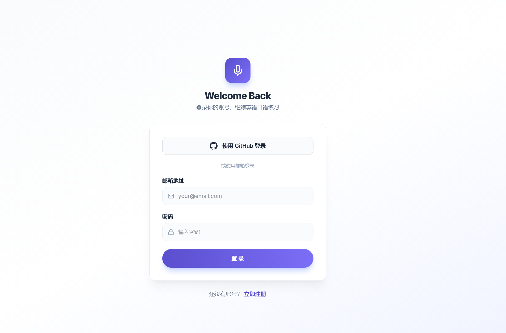](./项目演示图片/注册登录入口界面.png) | [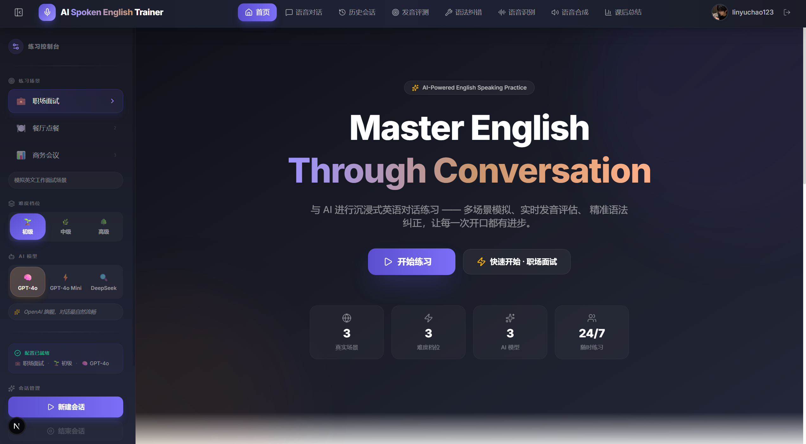](./项目演示图片/首页.png) |
| 支持邮箱注册 + GitHub OAuth 一键登录 | 场景选择、功能入口、快速开始练习 |

### 核心功能

| 语音对话主界面 | 课后总结报告 |
|---------------|-------------|
| [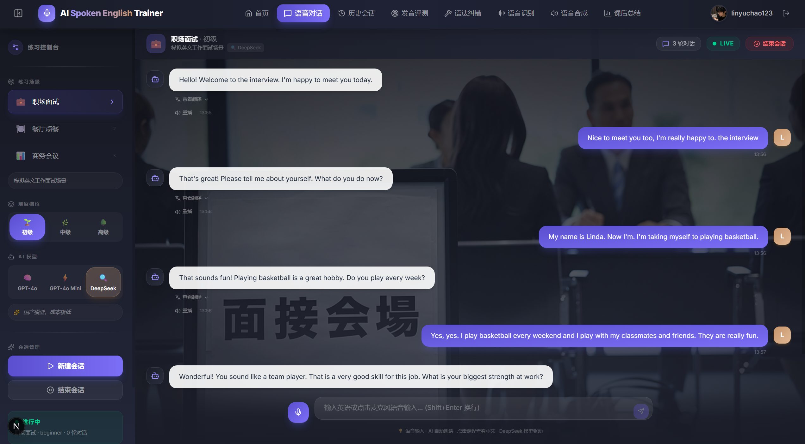](./项目演示图片/语音对话主界面.png) | [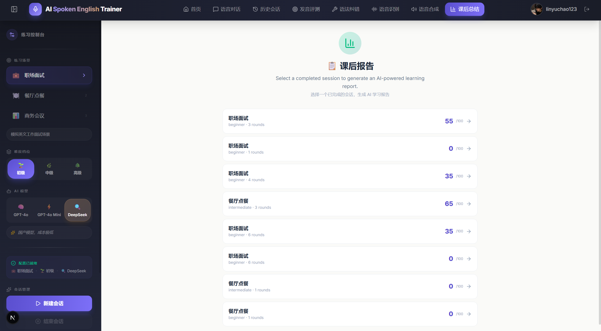](./项目演示图片/课后总结界面.png) |
| 场景化角色扮演，实时发音评分 + 语法纠错 | 六维综合评估 + 逐句分析 + 强弱项诊断 |

### 独立练习模块

| 发音评测 | 语法 & 表达纠错 |
|----------|----------------|
| [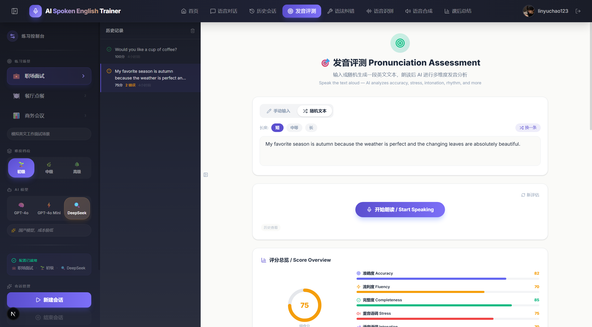](./项目演示图片/独立的发音评测界面.png) | [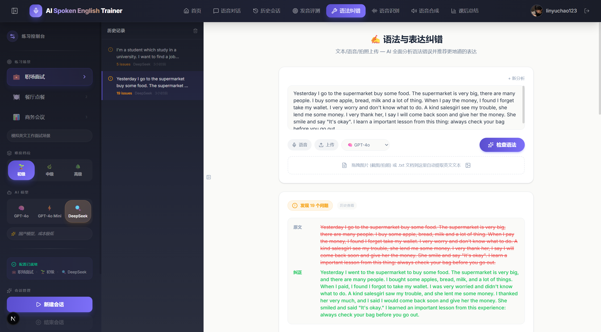](./项目演示图片/独立的语法&表达纠错界面.png) |
| 逐词发音定位 + 六维评分 + 历史记录 | 8 类语法检测 + 更优表达推荐 + 中英双语 |

| 语音识别 (ASR) | 语音合成 (TTS) |
|----------------|----------------|
| [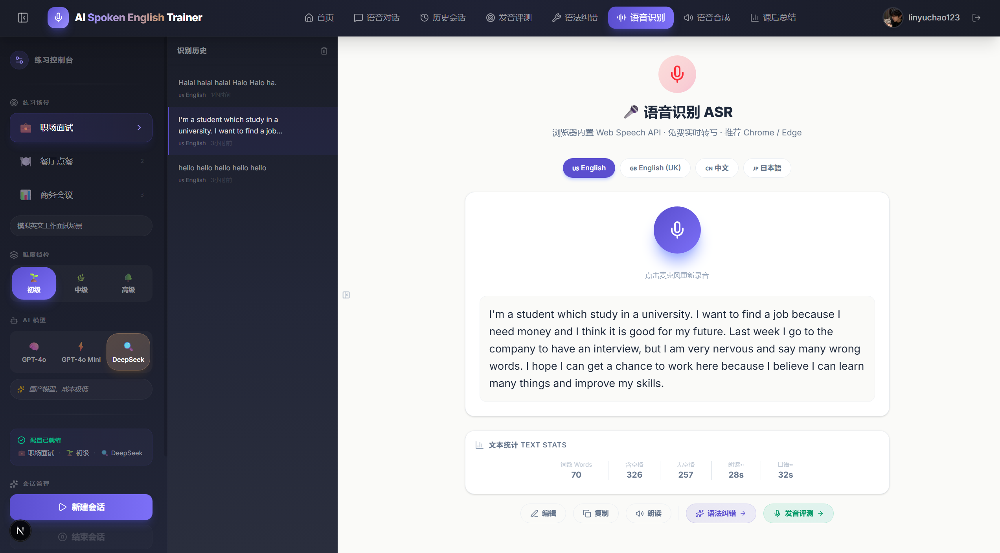](./项目演示图片/独立的语音识别ASR界面.png) | [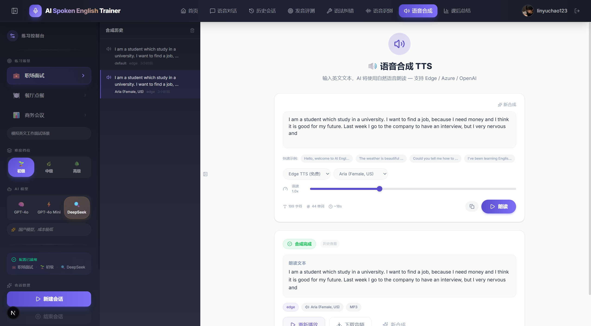](./项目演示图片/独立的语音合成TTS界面.png) |
| 四语种支持 + 实时转写 + 一键跳转纠错/发音 | 三级引擎切换 + 音色选择 + 在线试听下载 |

### 数据管理

| 历史对话记录 | 后端控制台 |
|-------------|-----------|
| [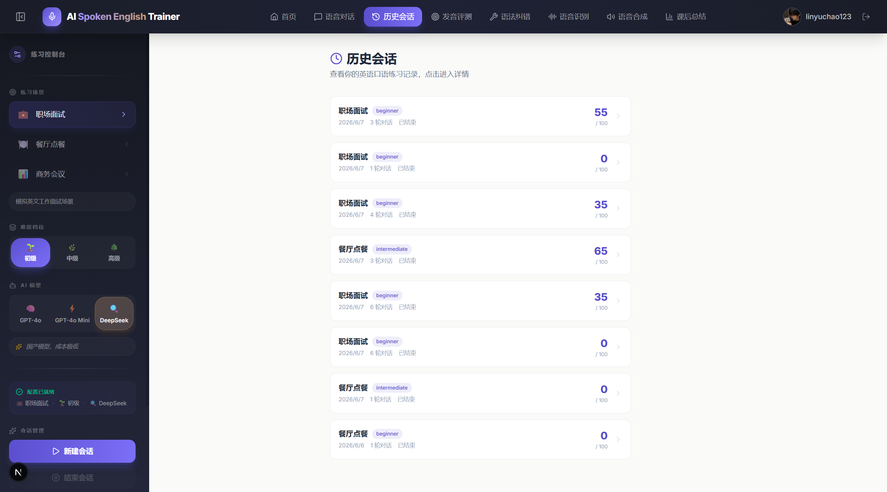](./项目演示图片/历史对话界面.png) | [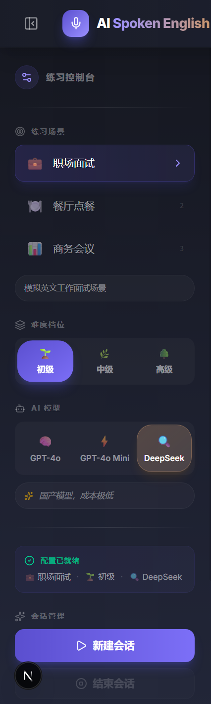](./项目演示图片/控制台.png) |
| 会话回放 + 翻译 + 导出打印 + 删除管理 | FastAPI 实时 API 日志 + 运行状态监控 |

---

## 项目亮点与效果

### 技术亮点

| 亮点 | 说明 |
|------|------|
| 🧠 **三模型差异化风格** | GPT-4o 温暖鼓励、GPT-4o-mini 简洁高效、DeepSeek 耐心教学——每个模型有独立"人设"，而非简单切换引擎 |
| 🔊 **免费 TTS 零门槛** | Edge TTS 免 API Key、免付费，~200ms 极速合成，配合自动播放实现无缝语音对话 |
| 📊 **六维量化评估** | 语法/词汇/流利度/表达/自然度/情感六个维度独立评分，附带逐句分析和强弱项诊断 |
| 🎯 **纠错后置不打断** | 对话流畅优先，纠错在后台异步完成，折叠面板呈现——想看看、不想看继续聊 |
| 🔗 **页面数据联动** | ASR → Grammar / Pronunciation → TTS 通过 URL 参数无缝跳转，形成练习闭环 |
| 📦 **零配置数据库** | SQLite WAL 模式 + 自动建表，clone 即有完整数据库，无需额外安装 |
| 🌐 **中英双语反馈** | 语法纠错、发音提示、学习报告全部提供英文+中文双语解释 |
| 🔐 **双通道认证** | 邮箱注册 + GitHub OAuth，HttpOnly Cookie 防 XSS |

### 实际效果

在 72 小时竞赛开发周期内，该系统成功实现了以下效果指标：

- ✅ **5 大核心功能全部闭环**：场景对话 → 发音评测 → 语法纠错 → ASR 转写 → TTS 合成 → 课后报告
- ✅ **11 个前端页面**：覆盖注册登录、首页、语音对话、4 个独立练习模块、历史记录、详情页、报告页
- ✅ **20 个 RESTful API**：全部通过 FastAPI 自动生成的 Swagger 文档可在线调试
- ✅ **3 套 LLM 风格 + 15 种 TTS 音色 + 3 个场景 × 3 个难度**：组合出丰富的练习配置
- ✅ **18 个 Pull Request**：严格遵守 Feature Branch + Squash & Merge 工作流，代码零冲突合并

---

## 架构设计亮点

- **前后端分离** — FastAPI + Next.js App Router，通过 RESTful API 解耦通信
- **模块化引擎** — LLM / TTS / Grammar / Pronunciation / Evaluation / Report 六大独立引擎，单一职责
- **三级 TTS 降级** — Edge → Azure → OpenAI，优先使用免费 Edge，API Key 未配置时自动跳过低级引擎
- **LLM 多模型路由** — 基于 OpenAI SDK 兼容接口统一调用 GPT-4o / GPT-4o-mini / DeepSeek，通过系统 Prompt 注入差异化风格
- **JWT Cookie 认证** — HttpOnly Cookie 防 XSS，自动携带跨域凭证
- **SQLite WAL 模式** — 读写并发性能优化，单文件零配置部署
- **AI 结构化输出** — 语法纠错和报告生成使用 JSON 结构化 Prompt，确保前端可解析
- **页面间数据联动** — 通过 URL Query 参数在 ASR → Grammar / Pronunciation → TTS 之间传递文本，形成练习闭环
- **localStorage 持久化** — 发音评测、语法纠错、ASR、TTS 四个独立页面各自维护历史记录（50 条上限），刷新不丢失

---

## 创新点说明

本项目的创新核心围绕 **"让 AI 陪练真正像一位耐心的英语老师"** 展开，从以下四个维度进行系统性设计：

### 1. 对话交互的自然度 —— 让 AI 不止「正确」，还要「像人」

> 传统口语练习工具的 AI 回复往往机械生硬，缺乏真实对话的节奏感和情感温度。

- **多模型风格注入**：不满足于简单切换模型，而是为每个模型定制独立的系统 Prompt 风格指令——GPT-4o 温暖鼓励（模仿友善母语者）、GPT-4o-mini 简洁高效、DeepSeek 耐心教学（模仿老师）。用户切换模型时，感受到的是不同"陪练人格"而非仅仅不同"引擎"
- **场景化角色扮演**：AI 根据选定场景自动代入角色身份——面试官会追问行为问题、服务员会主动推荐菜品、会议主持人会引导议题切换，而非泛泛地"一问一答"
- **动态难度适应**：同一场景下，初级难度 AI 使用基础词汇并放慢节奏，高级难度则使用母语级表达和深度追问，模拟真实语言进阶路径
- **开场白自动生成**：每个新会话由 LLM 根据场景+难度动态生成个性化开场白，而非固定模板

### 2. 语音端到端的流畅性与低延迟 —— 消除"等待感"

> 口语练习中，每多一秒等待都在削弱用户的表达欲望和沉浸感。

- **浏览器端语音识别 (Web Speech API)**：语音识别在浏览器本地完成，无需将音频上传服务器转写，消除网络往返延迟，实现边说边出字的实时体验
- **Edge TTS 零延迟合成**：默认采用微软 Edge TTS（免费、无需 API Key），合成速度极快——通常 200ms 内返回音频，配合自动播放策略实现 AI 回复"说完即播"
- **三级降级保障链路**：Edge（免费快速）→ Azure（高质量）→ OpenAI（兜底），任一引擎不可用时自动切换下一级，确保 TTS 服务永不中断
- **连续对话一气呵成**：用户说完→自动识别→AI 回复→自动朗读，全程无需点击，形成自然的"说-听-说"循环

### 3. 纠错的精准度与时机 —— 不打断，但让你知道错在哪

> 实时打断纠错会破坏口语流利度，但只给分数不说原因则无法进步。

- **"对话优先，纠错后置"策略**：对话过程中让用户自由表达，不打断、不中断。每轮对话完成后，系统在后台异步进行发音评估和语法分析，在消息气泡下方以折叠面板形式呈现——想看就看，不想看继续聊
- **8 类细分语法错误检测**：覆盖 grammar / vocabulary / word_order / preposition / article / tense / spelling / punctuation，精确定位问题类型而非笼统提示
- **中英双语纠正解释**：每处错误提供英文技术说明 + 中文通俗解释，消除理解门槛。例如不仅告诉你 "缺少冠词"，还告诉你 "英语中单数可数名词前需要加 a/an/the"
- **"更优表达"而非仅仅"正确"**：不仅纠正语法错误，还建议更地道自然的表达方式。即使句子语法正确，也会推荐母语者更常用的说法
- **逐词发音定位**：发音评测将整体分数细化到每个单词的准确度、错误类型和音标提示，用户可以精准定位是哪个音节出了问题

### 4. 口语能力提升的可量化反馈 —— 让进步"看得见"

> "我感觉自己进步了"不如"你的流利度从 62 提升到了 78"有说服力。

- **六维综合评估体系**：课后报告从语法 (Grammar)、词汇 (Vocabulary)、流利度 (Fluency)、表达 (Expression)、自然度 (Naturalness)、情感互动 (Emotion) 六个维度独立评分，避免单一分数掩盖真实能力结构
- **逐句深度分析**：LLM 对会话中的每条用户消息进行独立分析——发音问题、语法问题、表达优化建议逐条列出，形成"问题清单"式的可执行改进建议
- **强弱项自动诊断**：AI 综合全会话表现输出用户的明确强项（Strengths）和弱项（Weaknesses），附带针对性提升建议
- **评分历史追踪**：每次会话的发音评分自动归档，报告页面可对比历次会话得分变化，直观呈现学习曲线
- **能力等级评估**：基于全维度表现给出 CEFR 对齐的英语水平评估，帮助用户了解自己的口语处于 A1-C2 哪个阶段

---

## 开发计划

本项目为72小时竞赛开发项目，分3个PR完成：

| PR | 日期 | 内容 | 状态 |
|----|------|------|------|
| PR1 | 6.5 | 项目初始化、Next.js+FastAPI架构搭建、认证系统、数据库设计 | ✅ 已完成 |
| PR2 | 6.6 | 核心语音交互：LLM对话引擎+语法纠错+ASR转写+TTS合成 | ✅ 已完成 |
| PR3 | 6.7 | 发音评测接入、报告生成、前端全部页面开发与 UI 优化 | ✅ 已完成 |

---

## 开发过程

### 分支管理策略

项目采用 **Feature Branch Workflow**，所有开发工作在特性分支进行，通过 Pull Request 合并至 `main`。

| 分支类型 | 命名规范 | 示例 | 数量 |
|----------|----------|------|------|
| 新功能 | `feat/<模块名>` | `feat/llm-conversation-engine` | 10 |
| 缺陷修复 | `fix/<问题描述>` | `fix/github-oauth-encoding` | 3 |
| 文档更新 | `docs/<描述>` | `docs/sync-framework-migration-docs` | 1 |
| 项目初始化 | `pr<N>-project-setup` | `pr1-project-setup` | 1 |

**分支生命周期**：

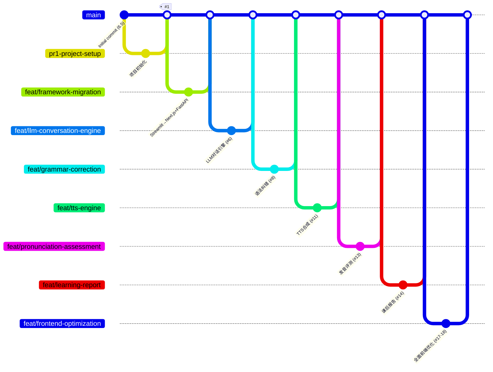

### PR 开发流程

全部 18 个 Pull Request 严格遵循以下工作流：

```
1. 从 main 拉取最新代码
       ↓
2. 创建特性分支 (feat/* / fix/* / docs/*)
       ↓
3. 按单一职责原则开发，每个 PR 聚焦一个功能模块
       ↓
4. 提交代码并推送至 GitHub
       ↓
5. 创建 Pull Request (标题使用中文描述)
       ↓
6. 代码审查通过后合并至 main (Squash & Merge)
       ↓
7. 删除已合并的特性分支
```

**PR 粒度规范**：每个 PR 聚焦一个模块或功能，避免跨模块混合提交。例如"LLM 对话引擎"和"语法纠错"分属两个独立 PR，确保回滚和审查的精确定位。

### Commit 记录规范

提交信息采用 **中文前缀分类 + 功能描述** 格式，便于快速理解改动意图：

| 前缀 | 含义 | 示例 |
|------|------|------|
| `feat:` | 新功能开发 | `feat: LLM对话引擎 — 双模型支持 + 场景化Prompt对话` |
| `fix:` | 缺陷修复 | `fix: 登录注册后跳转首页而非语音对话页` |
| `fixup:` | 关联功能的补充提交 | `fixup: 发音评估 — 补充路由/schemas/页面/API类型` |
| `docs:` | 文档更新 | `docs: 同步需求文档和README到 Next.js + FastAPI 新架构` |
| `refine:` | 代码优化 / UI 打磨 | `refine: 删除按钮移到卡片右侧外部，与卡片等高一致` |

所有提交描述均使用中文，采用 `模块名 — 具体描述` 的子格式，确保变更一目了然。

### 关键开发节点

项目从零到完整交付历时 **3 天（6.5 ~ 6.7）**，共提交 18 个 Pull Request：

| 阶段 | 时间 | 核心成果 | PR 编号 |
|------|------|----------|--------|
| 🚀 **项目启动** | 6.5 | 项目初始化、需求文档、Next.js + FastAPI 架构搭建 | #1 ~ #2 |
| 🔄 **架构迁移** | 6.6 | 从 Streamlit 全面迁移至 Next.js + FastAPI 全栈架构 | 框架迁移 |
| 🧠 **LLM 对话** | 6.6 | 双模型对话引擎、场景化 Prompt、多模型扩展与风格注入 | #6, #7 |
| ✏️ **语法纠错** | 6.6 | LLM 语法分析、中英双语解释、UI 重构、语音输入、文件上传 | #8, #9, #10 |
| 🔊 **语音能力** | 6.7 | TTS 三级引擎（Edge + Azure + OpenAI）、ASR 浏览器语音识别 | #11, #12 |
| 📊 **评测报告** | 6.7 | 发音评测（Web Speech + DeepSeek）、课后报告（六维评估） | #13, #14, #15 |
| 🎨 **前端优化** | 6.7 | 首页引导、场景背景、历史详情、多维评分 UI、响应式布局 | #16, #17 |
| 🐛 **缺陷修复** | 6.7 | OAuth 编码修复、登录跳转修复、hydration 错误修复 | #16, #18, 修复分支 |

### 开发节奏统计

```
6.5  ─ ████░░░░░░░░░░░░░░  项目启动 + 需求文档
6.6  ─ ████████████░░░░░░  框架迁移 + LLM对话 + 语法纠错 (10个PR)
6.7  ─ ██████████████████  语音能力 + 评测报告 + 前端优化 + 缺陷修复 (8个PR)
```

---

## 不足与未来优化

### 当前不足

尽管在 72 小时内完成了核心功能的闭环开发，受限于时间和资源，以下方面仍需改进：

| 不足 | 具体表现 | 原因 |
|------|----------|------|
| 📱 **缺少移动端适配** | 界面仅针对桌面端设计，手机上布局错乱、操作不便 | 72h 竞赛时间过紧，优先保证桌面端功能完整 |
| 🎤 **ASR 依赖浏览器 API** | Web Speech API 在 Firefox/Safari 上支持有限，识别准确度不如 Whisper | Whisper API 需要额外余额，用户计划后续接入 |
| 📝 **发音评测非音频级** | 当前为文本比对评分方案，非 Azure 原生音素级分析 | Azure 学生账号审批中，方案已预留接口 |
| 🎨 **UI 非响应式设计** | 侧边栏在小屏幕上占用过大空间，表格和卡片未做断点适配 | 开发时间集中在功能闭环，响应式为下一阶段重点 |
| 🔒 **缺少用户数据隔离** | 所有用户共享同一个 SQLite 数据库文件 | 当前为单用户/演示模式设计，多用户场景需增加权限控制 |
| 🧪 **缺少自动化测试** | 无单元测试和端到端测试覆盖 | 72h 内以功能实现为第一优先级 |
| 🌍 **场景数量有限** | 仅 3 个预设场景，缺乏自定义场景能力 | 预设场景的 Prompt 和背景图需要精心设计 |
| 📊 **报告不支持导出 PDF** | 当前仅支持浏览器打印，不能一键生成 PDF 文件 | 实现成本不高，优先级排后 |

### 未来规划

计划从以下方向持续迭代，逐步将 Demo 演进为可正式上线的产品：

**短期优化（1-2 周）**：

- 📱 **移动端适配**：使用 Tailwind 响应式断点（sm/md/lg/xl）对全部 11 个页面做移动端适配，优先保证注册、对话、报告三个核心流程在手机上的体验
- 🎤 **Whisper API 接入**：替换 Web Speech API 为 OpenAI Whisper，提升识别准确率和浏览器兼容性
- 📝 **Azure 发音评测接入**：待学生账号审批通过后，接入 Azure Pronunciation Assessment 实现真正的音素级评分

**中期规划（1-2 月）**：

- 📲 **微信小程序开发**：将核心对话+纠错+报告功能封装为微信小程序，降低用户触达门槛
- 🎨 **自定义场景系统**：允许用户自定义场景名称、AI 角色、对话风格，上传场景背景图
- 📊 **学习仪表盘**：提供长期的发音评分趋势图、词汇量增长曲线、活跃天数统计

**长期愿景（3-6 月）**：

- 🏗️ **SaaS 化改造**：用户体系升级（多租户数据隔离）、订阅制付费（按月/按年）、云端部署
- 📱 **移动端 App（React Native/Flutter）**：实现真正的原生移动体验，支持离线语音识别
- 🌐 **多语言扩展**：支持日语、韩语、法语、西班牙语等更多语种的口语练习
- 🤖 **AI 教师定制**：用户可选择 AI 教师的"国籍/口音/性格"，实现更个性化的学习体验

---

## 开源库引用

| 库名 | 版本 | 用途 | 许可证 |
|------|------|------|--------|
| fastapi | >=0.111.0 | Web API 框架 | MIT |
| uvicorn | >=0.30.0 | ASGI 服务器 | BSD-3 |
| PyJWT | >=2.8.0 | JWT 令牌管理 | MIT |
| openai | >=1.12.0 | OpenAI API 客户端 (LLM + TTS) | Apache 2.0 |
| edge-tts | >=6.1.0 | Edge TTS 免费语音合成 | MIT |
| azure-cognitiveservices-speech | >=1.35.0 | Azure 语音服务 (TTS 备选 + 未来发音评测) | MIT |
| python-dotenv | >=1.0.0 | 环境变量管理 | BSD-3 |
| requests | >=2.31.0 | HTTP 请求 (GitHub OAuth) | Apache 2.0 |
| pydantic | >=2.0 | 数据验证 | MIT |
| next | 14.x | React 前端框架 | MIT |
| react | 18.x | UI 库 | MIT |
| tailwindcss | 3.x | CSS 框架 | MIT |
| zustand | 4.x | 状态管理 | MIT |
| axios | 1.x | HTTP 客户端 | MIT |
| lucide-react | 0.x | 图标库 | ISC |

---

## 第三方API引用

| API服务 | 用途 |
|---------|------|
| OpenAI API | GPT-4o对话模型、Whisper语音识别、TTS语音合成 |
| DeepSeek API | 备选对话模型 |
| Azure Speech Services | 发音评测（Pronunciation Assessment）、备选TTS |

---

## 常见问题 FAQ

<details>
<summary><strong>Q: 语音识别无法使用怎么办？</strong></summary>

A: 浏览器语音识别依赖 Google Web Speech API，在中国大陆可能需要代理/VPN。也可使用 ASR 页面提供的手动输入替代方案，或直接在各页面文本框中输入英文。
</details>

<details>
<summary><strong>Q: Edge TTS 是否需要 API Key？</strong></summary>

A: 不需要。Edge TTS 完全免费、零配置，是系统默认的 TTS 引擎。Azure 和 OpenAI TTS 需要对应 API Key。
</details>

<details>
<summary><strong>Q: 没有 OpenAI API Key 能使用吗？</strong></summary>

A: 部分功能可用。TTS 可用免费的 Edge TTS；但 LLM 对话、语法纠错、发音评测、报告生成需要至少一个 LLM API Key（OpenAI 或 DeepSeek）。建议至少配置 DeepSeek API Key（成本极低）。
</details>

<details>
<summary><strong>Q: 如何切换 AI 模型？</strong></summary>

A: 在左侧边栏「AI 模型」区域选择一个模型，新建的会话将使用所选模型。三个模型的对话风格各有侧重：GPT-4o 最自然、GPT-4o-mini 最快速、DeepSeek 最具教学性。
</details>

<details>
<summary><strong>Q: 前端端口被占用了怎么办？</strong></summary>

A: Next.js 默认使用 3000 端口。如果被占用，可以用 `npx next dev -p 3001` 指定其他端口，同时修改 `backend/main.py` 中 CORS 的 allow_origins 和 `.env` 中的 FRONTEND_URL。
</details>

<details>
<summary><strong>Q: 数据库文件在哪里？如何重置？</strong></summary>

A: 数据库文件位于 `data/sessions.db`。如需重置，删除该文件后重启后端即可自动重建。注意这将清除所有用户和会话数据。
</details>

<details>
<summary><strong>Q: 支持哪些浏览器？</strong></summary>

A: 推荐使用 Chrome 或 Edge（Chromium 内核）以获得完整的语音识别支持。Firefox 和 Safari 的 Web Speech API 支持有限。
</details>

---

## 总结

AI英语口语陪练基于 Next.js + FastAPI 全栈架构，将 LLM 对话引擎、语音识别与合成、发音评测、语法纠错、课后量化报告五大核心能力整合为一个完整的口语学习闭环。项目从"让 AI 陪练真正像一位耐心的英语老师"这一核心理念出发，围绕以下四个维度进行了系统性创新：

### 回顾：四大创新维度的落地

**对话交互的自然度** — 通过多模型差异化风格注入（GPT-4o 温暖鼓励 / GPT-4o-mini 简洁高效 / DeepSeek 耐心教学），让用户在切换模型时感受到的是不同"陪练人格"而非不同"引擎"。结合场景化角色扮演和动态难度适应，AI 能根据场景身份调整对话策略，从初级的基础词汇慢速引导到高级的母语级深度追问，形成渐进式的真实对话体验。

**语音端到端的流畅性** — 浏览器端 Web Speech API 实现本地语音识别，消除音频上传的往返延迟；Edge TTS 以 ~200ms 极速合成配合自动播放策略，让整个"说-听-说"循环一气呵成、无需点击。三级降级保障链路（Edge → Azure → OpenAI）确保 TTS 服务在任何配置下都可用，真正做到了零门槛开箱即用。

**纠错的精准度与时机** — 坚持"对话优先，纠错后置"的设计哲学：对话过程中不打断用户，每轮结束后在消息气泡下方以折叠面板呈现发音评分和语法分析。8 类细分语法错误检测精确定位问题类型，中英双语解释消除理解门槛，"更优表达"推荐让纠正不止于"对错"、更引导"地道"。逐词发音定位则让用户精准知道哪个音节需要改进。

**口语能力的可量化反馈** — 六维综合评估体系（语法 / 词汇 / 流利度 / 表达 / 自然度 / 情感互动）避免单一分数的片面性。逐句 LLM 深度分析形成"问题清单"式的可执行建议，强弱项自动诊断帮助用户明确优先级。评分历史追踪和能力等级评估（CEFR 对齐）让"我进步了"从模糊感受变为可追溯的数据曲线。

### 项目价值

与市面上以"跟读+打分"为主的单向练习工具不同，本项目构建了一个双向、沉浸、有温度的 AI 口语陪练体验——用户不再面对冰冷的打分面板，而是与一个会鼓励、会追问、会纠正的"AI 老师"进行真实对话。从打开浏览器到开始第一次口语练习，仅需一次注册、零额外配置，大幅降低了英语口语练习的心理门槛和经济门槛。

系统已具备从用户认证、语音交互、智能纠错到数据报告的产品化骨架。未来通过移动端适配和微信小程序开发，将进一步打破设备和场景限制，让口语练习真正融入用户的碎片化时间，从"Demo"走向"真正可用的产品"。

---

## 许可证

本项目采用 MIT 许可证。

---

## 联系方式

如有问题或建议，欢迎提交 Issue 或 Pull Request。
